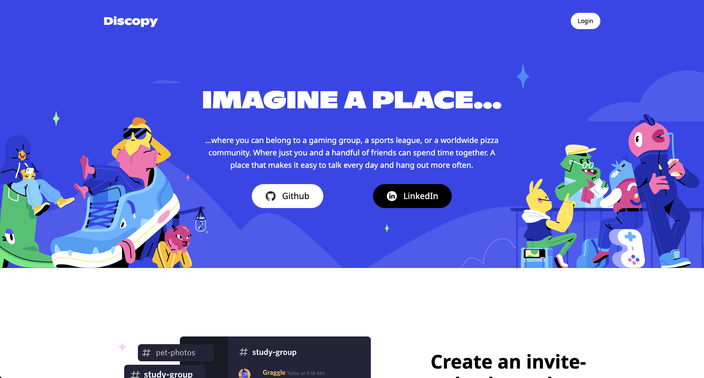

# Discopy

Discopy is a full-stack project clone of the popular social messaging platform Discord.
Users may register for the site or log in with the demo account.  Once logged in, they
can create, edit and delete their own servers, as well as text channels within those servers.
They can also send and receive messages in real-time with other members of the same server
in a particular channel.

## Technologies
* PostgreSQL - backend relational database
* Ruby on Rails - backend data fetching API
* Javascript and React - frontend design composition
* Redux - frontend state management

## Setup
Clone this repo to your desktop and do the following:
* Run `bundle install` in the root directoy to install the backend dependencies
* Navigate to the "frontend" folder and run `npm install` to install the frontend dependencies

## Usage
Once the dependencies are installed via setup, you can run `rails s` to start up the backend server.

Next, navigate to the "frontend" and run `npm start` to start the application. You will then be able 
to access it at localhost:3000.